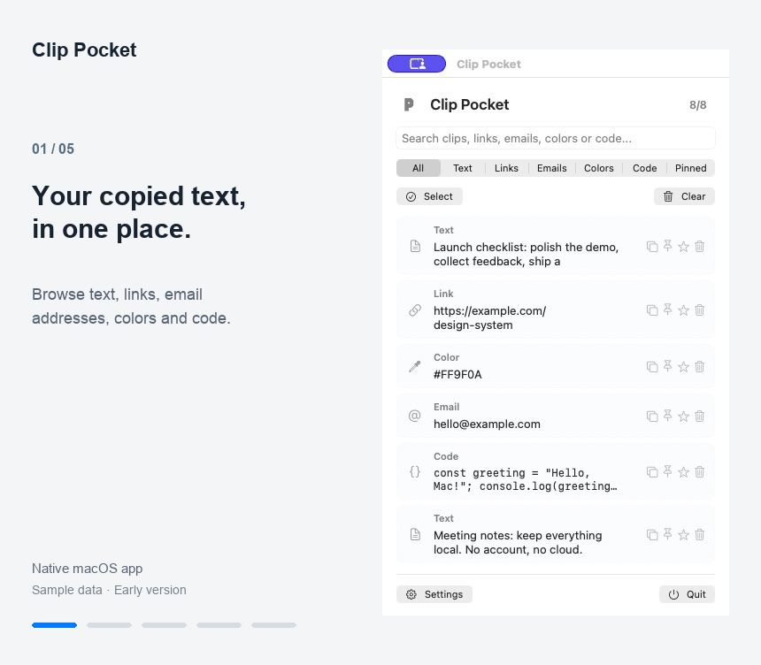
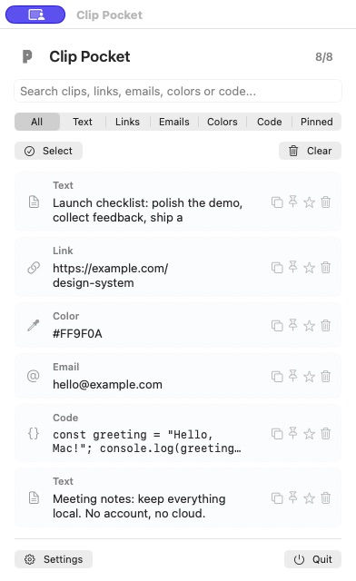
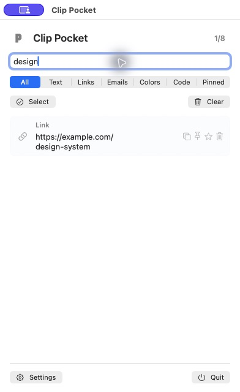
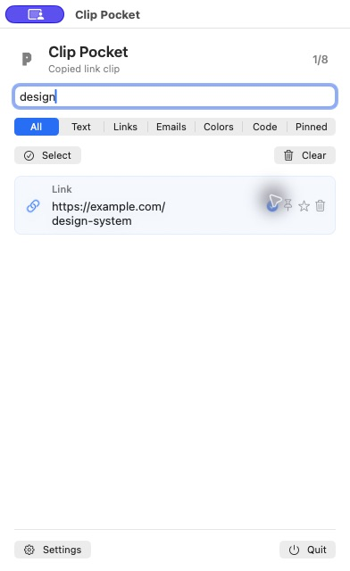
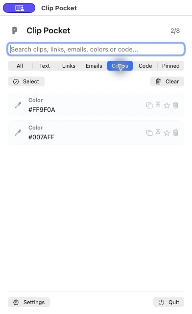
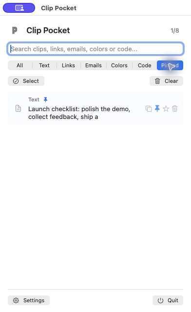

# Clip Pocket — visual walkthrough

Search, filter, pin and copy text from a local clipboard history.

## 1. Browse clipboard history

Text, links, email addresses, colors and code snippets appear in one local list.

## 2. Search for a clip

Typing `design` finds the example design-system link.

## 3. Copy the result

The Copy action puts the selected text back on the clipboard and shows confirmation.

## 4. Filter by type

The Colors filter narrows the list to the two example color values.

## 5. Keep a note handy

A pinned launch checklist appears under Pinned.

## About these captures

Captured on 2026-09-14 from the native macOS app. Each GIF frame uses a real screenshot, with explanatory captions outside the app window. It is a step-by-step walkthrough, not a continuous screen recording.

Source snapshot: [`3489607`](https://github.com/testerwebu/clip-pocket/tree/3489607f908b9b25671942cd1e085ff9eccabbc9).

All visible content is fictional sample data. The captures use a separate demo application identity and isolated settings. Clipboard storage and monitoring were redirected to a demo data source so personal clipboard history could not appear.

The production app source is unchanged by this documentation update. The repository README describes the current release status and limitations.
